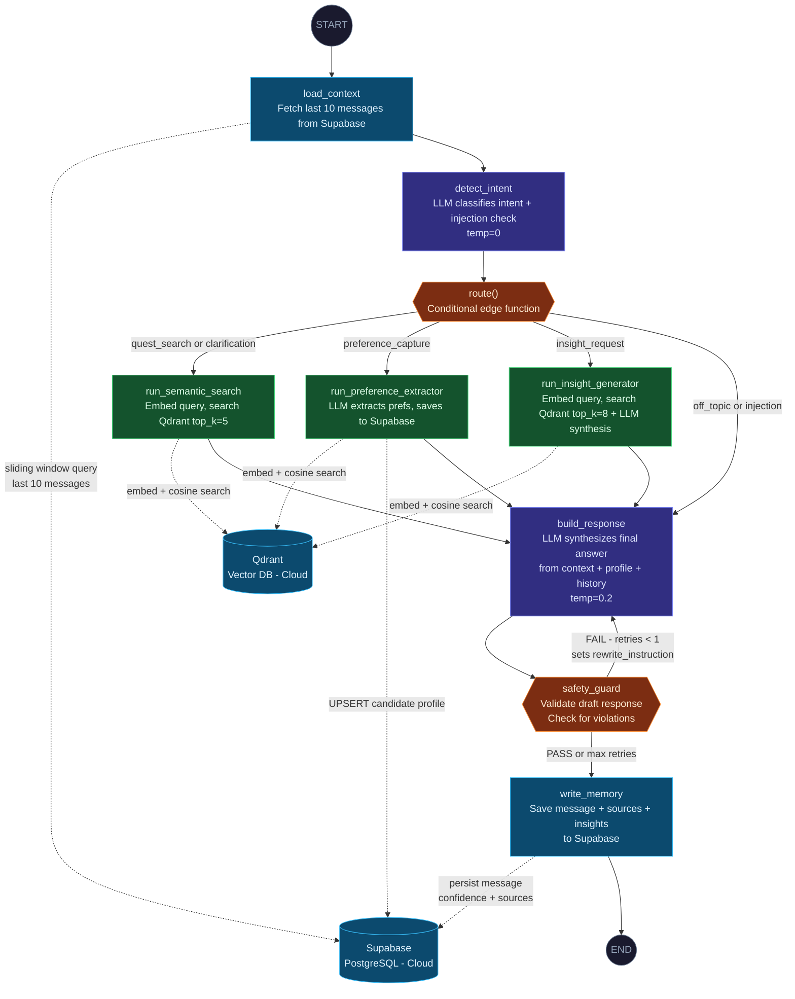

# Quest Copilot — Agentic System Architecture

A full breakdown of the LangGraph-based agent: how nodes connect, which tools each node uses, and how data flows through the system.

---

## Node Flow Diagram



---

## Node Descriptions

| Node | Role | LLM Used | Temp |
|---|---|---|---|
| `load_context` | Loads the last 5 turns (10 messages) from Supabase as conversational memory | — | — |
| `detect_intent` | Classifies user intent into one of 5 categories. Also detects prompt injection. | `llama-3.3-70b-versatile` | 0 |
| `route()` | Conditional edge function. Maps intent string to the next node name. | — | — |
| `run_semantic_search` | Embeds the user query and retrieves top-5 chunks from Qdrant. | — | — |
| `run_preference_extractor` | Extracts tech stack, preferred roles, and summary from user message, then saves/merges into `candidate_profiles`. Also runs a semantic search. | `llama-3.3-70b-versatile` | 0 |
| `run_insight_generator` | Retrieves top-8 chunks then prompts the LLM to synthesize an insight. | `llama-3.3-70b-versatile` | 0.2 |
| `build_response` | Combines retrieved context, candidate profile, and chat history into a final prose answer. | `llama-3.3-70b-versatile` | 0.2 |
| `safety_guard` | Validates the draft response. Fails if it contains code, reveals instructions, or is off-topic. Can loop back once to `build_response` with a rewrite instruction. | — | — |
| `write_memory` | Persists the final assistant message, sources, confidence, and insights to Supabase. | — | — |

---

## Intent Routing Table

| Detected Intent | Routed To |
|---|---|
| `quest_search` | `run_semantic_search` |
| `clarification` | `run_semantic_search` |
| `preference_capture` | `run_preference_extractor` |
| `insight_request` | `run_insight_generator` |
| `off_topic` | `build_response` (direct, no retrieval) |
| `injection_detected` | `build_response` (with safe redirect, no retrieval) |

---

## Tools Reference

All tools are defined in `Backend/src/agent/tools.py`.

| Tool | Used By Node | What It Does | External System |
|---|---|---|---|
| `semantic_search(query, top_k)` | `run_semantic_search`, `run_insight_generator`, `run_preference_extractor` | Embeds the query using a Sentence Transformer model and retrieves closest document chunks by cosine similarity | **Qdrant Cloud** |
| `extract_and_save_preferences(user_id, data)` | `run_preference_extractor` | Merges `tech_stack`, `preferred_roles`, `experience_years`, and `summary` into the `candidate_profiles` table using union logic to avoid overwriting data | **Supabase** |
| `build_context_string(chunks)` | `build_response`, `run_insight_generator` | Formats a list of vector chunks into a clean numbered string for LLM prompt injection | Internal |
| `format_history_for_prompt(history)` | `detect_intent`, `build_response`, `run_insight_generator` | Converts LangChain message objects into a plain `User: ... / Assistant: ...` string for prompt context | Internal |
| `check_safety(response_text)` | `safety_guard` | Prompts the LLM to validate the draft response against safety rules. Returns `passed`, `violation`, and `rewrite_instruction` | Internal (LLM call) |
| `get_context_window(conversation_id)` | `load_context` | Queries Supabase for the last 10 messages ordered by `created_at`, reversed to chronological order | **Supabase** |
| `save_assistant_message(...)` | `write_memory` | Inserts the final assistant turn into the `messages` table with `sources`, `confidence`, and `reasoning` fields | **Supabase** |

---

## Safety Guard Logic

The `safety_guard` node uses a conditional edge function (`safety_route`) with the following behavior:

```
safety_passed = True           → write_memory  (normal path)
safety_passed = False
  └── safety_retries < 1      → build_response (retry with rewrite_instruction)
  └── safety_retries >= 1     → write_memory   (emit safe fallback message)
```

This prevents infinite loops while still allowing one self-correction attempt.

---

## External Services

| Service | Purpose | Connection |
|---|---|---|
| **Qdrant Cloud** | Stores document chunk embeddings. Used for all semantic search operations. | REST via `qdrant-client` using `QDRANT_URL` + `QDRANT_API_KEY` |
| **Supabase (PostgreSQL)** | Stores users, conversations, messages, candidate profiles, and insights. | `asyncpg` connection pool via `DATABASE_URL` |
| **Groq (LLM Provider)** | Hosts `llama-3.3-70b-versatile` for all LLM inference. | REST via `langchain-groq` using `GROQ_AGENT_API_KEY` |
| **Sentence Transformers** | Generates embeddings locally for query and document encoding. | Pre-loaded model on app startup (`EMBEDDING_MODEL` env var) |
