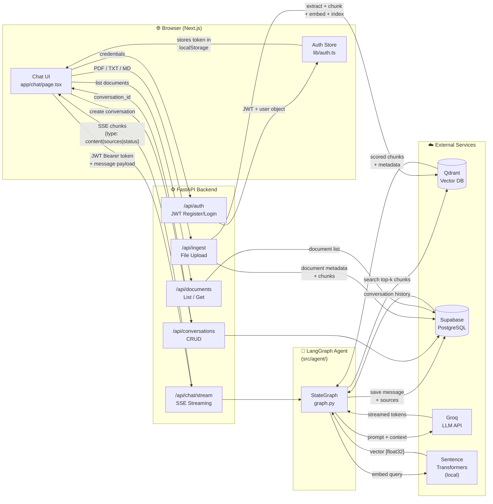
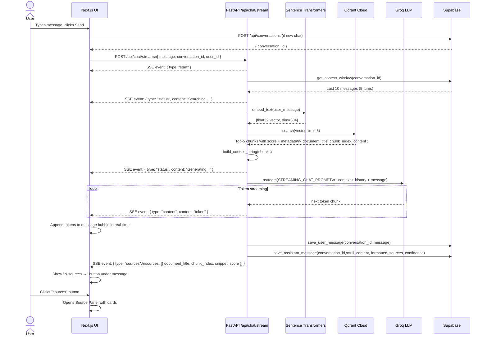
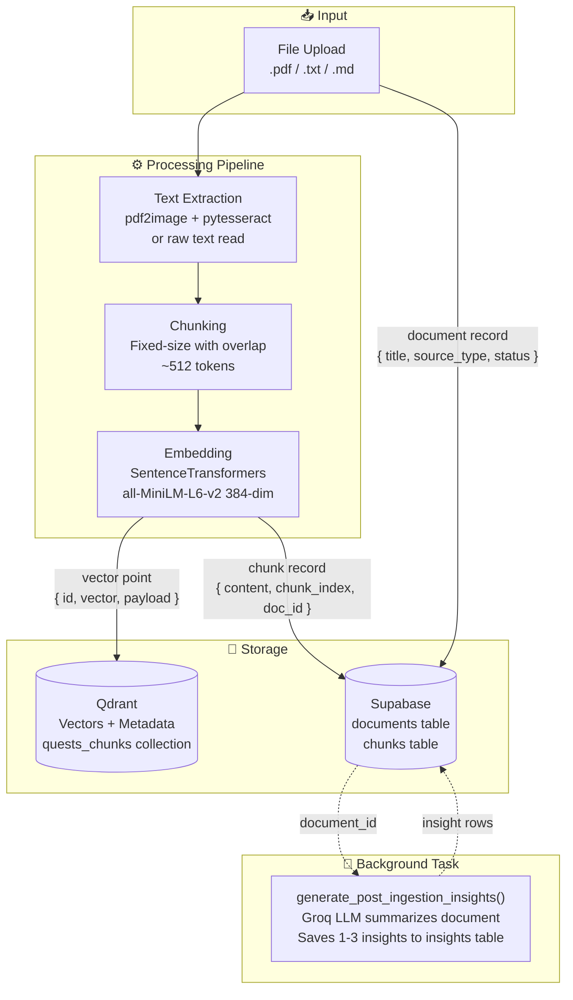
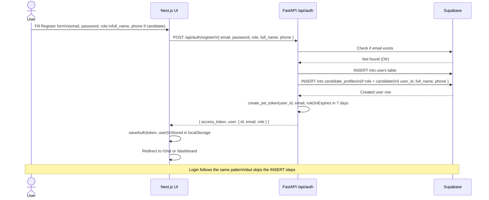
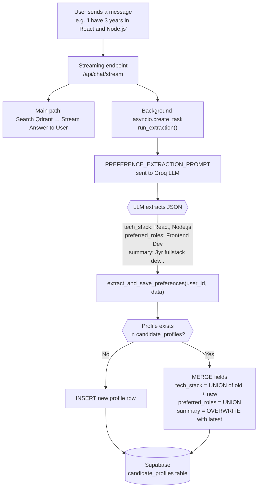

# Quest Copilot — Data Flow Diagram

This document shows how **data moves** through the system, from the moment a user types a message to when the response is saved and displayed.

---

## High-Level System Data Flow

---

## Chat Message Data Flow (Detailed)

This zooms into the full lifecycle of a single user message through the streaming pipeline.

---

## Document Ingestion Data Flow

Shows what happens when a file is uploaded to the knowledge base.

---

## Authentication Data Flow

---

## Candidate Profile Update Flow

Shows how the AI silently keeps the candidate profile up to date during conversations.

---

## Data Store Summary

| Store | Technology | What It Holds |
|---|---|---|
| **Qdrant** | Vector Database (Cloud) | Document chunk embeddings + metadata (title, chunk_index, source) |
| **Supabase - `users`** | PostgreSQL | Email, password hash, role, full_name |
| **Supabase - `candidate_profiles`** | PostgreSQL | full_name, phone, summary, tech_stack[], preferred_roles[], experience_years |
| **Supabase - `conversations`** | PostgreSQL | conversation_id, user_id, status, last_message_at |
| **Supabase - `messages`** | PostgreSQL | role, content, sources (JSONB), confidence, reasoning |
| **Supabase - `documents`** | PostgreSQL | title, source_type, status, raw_text |
| **Supabase - `chunks`** | PostgreSQL | content, chunk_index, qdrant_point_id |
| **Supabase - `insights`** | PostgreSQL | title, body, category, relevance_score |
| **localStorage** | Browser | JWT token + user object (session persistence) |
